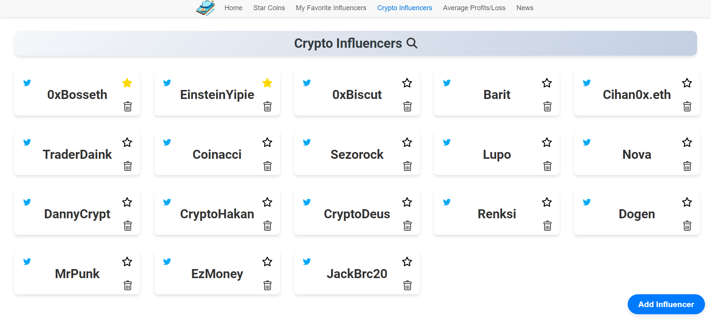
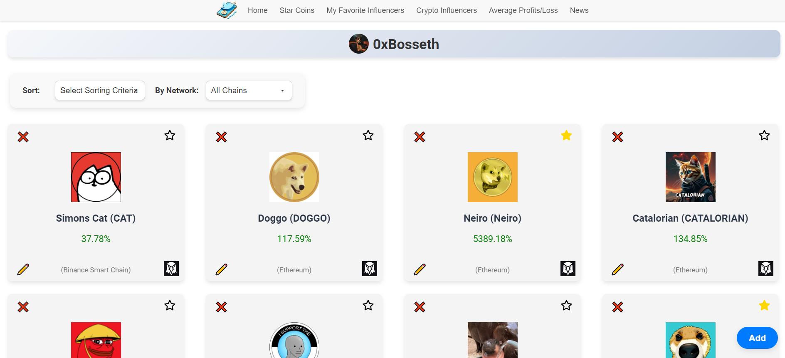

# Coin-Tracker Application

## 📈 Project Description

**Coin-Tracker** is a comprehensive web application that allows users to track the performance of coins shared by their favorite crypto influencers, manage their favorite coins, and perform average profit/loss analysis. The application fetches real-time data using the **DexScreener API** to provide current price and market cap information. Additionally, it delivers the most up-to-date cryptocurrency news via **RSS feeds**, allowing users to read the latest news directly within the app. Coin-Tracker aims to provide valuable insights for crypto investors by focusing on the success of influencers' shared coins through its user-friendly interface and efficient data management.

🔗 **Live Demo:** [Access Coin-Tracker Here](https://cointracker-canozgen.netlify.app/)

---

## 🖼️ Application Screenshots

### **Home Page**
The home page where users can view the overall performance of coins shared by influencers.

---

### **Influencers Page**
The page where users can manage their favorite influencers and the coins they follow.

---

### **News Page**
The RSS feed page that displays the latest cryptocurrency news for users.

---

### **Starred Coins - Mobile View**
The mobile version of the "Starred Coins" section, allowing users to manage favorite coins easily on smaller devices.

---

### **Profit/Loss Table**
A detailed table showing the profit/loss analysis of various coins.

---

### **Favorite Influencers Page**
Where users can manage their favorite influencers, who they trust the most for crypto insights.

---

### **User Profile Page**
Each user's profile page where specific information about their coin performance is displayed.

---

## 🛠️ Technologies Used

### **Frontend:**
- **React**: Core framework for building the user interface.
- **React Router DOM**: For navigation between pages.
- **Axios**: For managing HTTP requests.
- **FontAwesome**: For icon usage.
- **React Beautiful DnD**: For drag-and-drop functionality.
- **React Fast Marquee**: For smooth scrolling text.
- **React Icons**: For additional icons.
- **React Number Format**: For formatting numerical data.
- **CSS Grid & Flexbox**: For creating responsive and flexible layouts.
- **Responsive Design**: Ensuring adaptability across various devices using media queries.

### **Backend:**
- **Node.js & Express**: For server-side development.
- **MongoDB & Mongoose**: For database management.
- **Axios**: For interacting with external APIs.
- **Cors**: For managing CORS policies.
- **Dotenv**: For handling environment variables.
- **Body-Parser**: For parsing the body of HTTP requests.