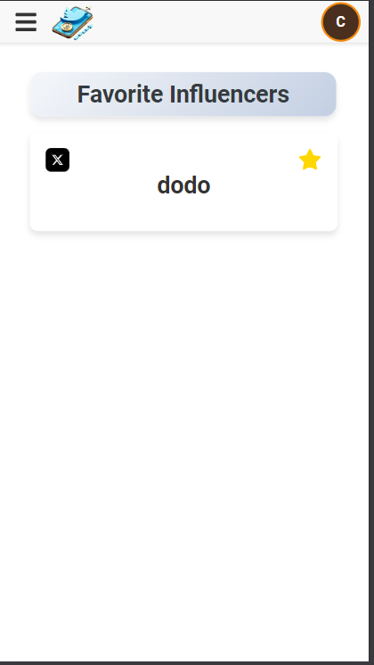

# Coin-Tracker Application

## 📈 Project Description

**Coin-Tracker** is a personalized cryptocurrency analysis application that allows users to track coins shared by their favorite crypto influencers, add and manage their own influencers and coins, and perform average profit/loss analysis based on the coins they follow. The app fetches real-time data from the **DexScreener API** for up-to-date price and market cap information and delivers the latest cryptocurrency news via **RSS feeds** directly within the app. With its user-friendly interface and efficient data management, Coin-Tracker provides valuable insights for navigating the **GEM market**, allowing users to make informed, high-risk, high-reward investment decisions.

🔗 **Live Demo:** [Access Coin-Tracker Here](https://cointracker-canozgen.netlify.app/)

---

## 🖼️ Application Screenshots

### **Home Page**
The home page displays a live ticker of the top 50 coins, as well as personalized insights like **Influencer with Highest Average Profit**, **Top Performing Coin**, and **Influencer with Most Coins**.

---

### **Influencers Page**
The Influencers Page is divided into **My Influencers Page** and **Admin Influencers Page**:

- **My Influencers Page**: Users can view and manage their added influencers. They can add or remove favorites and track the performance of coins shared by these influencers.
  
- **Admin Influencers Page**: This page displays influencers added by the admin. Users can:
  - **View Admin Influencers and Their Coins**: Users can see admin-added influencers and the performance of coins shared by them, though they cannot modify these entries.
  - **Notification Settings**: Users can enable notifications for admin influencers. By clicking the notification button and entering their email, they will receive an email notification each time the admin adds a new influencer or coin.

---

### **News Page**
The RSS feed page displays the latest cryptocurrency news, allowing users to stay updated on the latest trends in the crypto world.

---

### **Starred Coins - Mobile View**
The mobile view of the "Starred Coins" section allows users to manage their favorite coins easily on smaller devices.

---

### **Profit/Loss Table**
This table provides each user with a personalized average profit/loss analysis based on the coins of influencers they have added. This feature helps users evaluate their investments more effectively.

---

### **Favorite Influencers Page**
The page where users can manage their favorite influencers. Users can track the performance of their most trusted influencers and add or remove them from their favorites.

---

### **Influencer Coins Page**
The **Influencer Coins Page** allows users to view the detailed performance of coins shared by their selected influencers. On this page, users can:

- **Favorite Actions**: Add or remove coins from favorites.
- **Coin Management**: Users can edit or delete coins shared by their own influencers. However, they do not have permission to edit or delete coins shared by admin influencers.
- **Coin Performance**: View real-time performance and personalized analysis of each coin.

This feature provides detailed information on the coins shared by influencers, helping users better manage their investment strategies.

---

### **Authentication**
The app includes an **authentication** feature, allowing users to register and log in to create personalized profiles and tailor their experience within the app. Key features enabled by authentication:

- **Sign Up & Log In**: Users can create their accounts and log in to access personalized features.
- **Personal Influencer Management**: Registered users can add and manage their own influencers, set favorites, and track the performance of coins associated with them.
- **Admin Influencer Access**: Each user can view the influencers and coins added by the admin but cannot edit these entries.
- **Notification Settings**: Users can enable notifications for admin influencers and enter their email to receive instant notifications whenever the admin adds a new influencer or coin.

These features make Coin-Tracker a user-friendly platform, allowing each user to conduct personal investment analysis.

---

## 🛠️ Technologies Used

### Frontend:
- **React**: Core framework for building the user interface.
- **React Router DOM**: For navigation between pages.
- **Axios**: For managing HTTP requests.
- **FontAwesome** & **React Icons**: For icon usage.
- **React Beautiful DnD**: For drag-and-drop functionality.
- **React Fast Marquee**: For smooth scrolling text.
- **React Number Format**: For formatting numerical data.
- **CSS Grid & Flexbox**: For creating responsive and flexible layouts.
- **Responsive Design**: Ensuring adaptability across various devices using media queries.

### Backend:
- **Node.js & Express**: For server-side development.
- **MongoDB & Mongoose**: For database management.
- **Axios**: For interacting with external APIs.
- **Cors**: For managing CORS policies.
- **Dotenv**: For handling environment variables.
- **Body-Parser**: For parsing the body of HTTP requests.
- **Nodemailer**: A library for sending emails, used for sending notification emails to users.
- **Gmail SMTP**: The Gmail SMTP server is used to securely send notification emails to users.

